13/01/2021

<!-- README.md is generated from README.Rmd. Please edit that file -->
rsimpop
=======

<!-- badges: start -->
<!-- badges: end -->
Installation
------------

You can install rsimpop like so:

``` r
devtools::install_github("NickWilliamsSanger/rsimpop")
```

rsimpop
-------

This package facilitates the simultaneous simulation of multiple cellular compartments each with their own target population size and potentially also sub-compartments with differential fitness (driver compartments).

### TODO

Setting parameters is somewhat convoluted in this early version. The next step will be to wrap up the parameter setting in and S3 R class RSimpopParam.

Simulate from Zygote for 1 year and subsample tree
--------------------------------------------------

``` r

##Initialise with seed (R and rsimpop separately)
SEED=37774321
initSimPop(SEED,bForce = TRUE)
#> NULL
##Setup a single compartment with a target pop of 50K
cfg=getDefaultConfig(target_pop_size  = 5e4,ndriver = 1,basefit = 0.2,rate = 0.1)
print(cfg)
#> $compartment
#>   val rate popsize      desc
#> 1   0 -1.0       1  outgroup
#> 2   1  0.1   50000 cellType1
#> 
#> $info
#>   val population fitness id driver1
#> 1   0          0       0  0       0
#> 2   1          0       0  0       0
#> 
#> $drivers
#>   val driver fitness
#> 1   1      1       0
##Simulate for 2years..
sp=sim_pop(NULL,params=list(n_sim_days=365*2,b_stop_at_pop_size=1),cfg=cfg)
#> n_sim_days: 730
#> b_stop_if_empty: 0
#> b_stop_at_pop_size: 1
#> maxt: 0
#> driver_rate_per_cell_per_day: 0
#> MAX_EVENTS= 1460 
#> MAX_SIZE= 150003
##Look at the population size trajectory
plot(sp)
```


``` r
##Subsample tree
sampledtree1=get_subsampled_tree(sp,100)
#> Starting checking the validity of tmp...
#> Found number of tips: n = 101 
#> Found number of nodes: m = 100 
#> Done.
print(sampledtree1)
#> 
#> Phylogenetic tree with 101 tips and 100 internal nodes.
#> 
#> Tip labels:
#>  s1, s2, s3, s4, s5, s6, ...
#> 
#> Rooted; includes branch lengths.
plot_tree(sampledtree1,cex.label = 0.5)
#> 
#> Phylogenetic tree with 101 tips and 100 internal nodes.
#> 
#> Tip labels:
#>  s1, s2, s3, s4, s5, s6, ...
#> 
#> Rooted; includes branch lengths.
title("Sampled Zygote Tree: Division Tree")
```

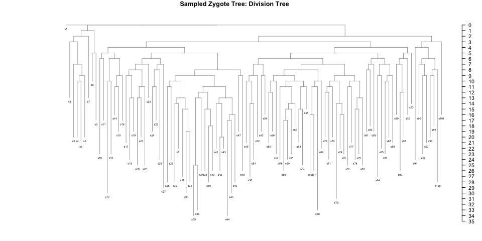

Notice how the sampled tree has 101 tips rather than the specified 100. This is because the simulator now always maintains an inactive outgroup (here s1). A group is rendered inactive by specifying a negative "rate" in the cfg$compartment dataframe. The tree branch lengths are now given in terms of the number of self renewal divisions. This allows the user to flexibly apply their own mutation acquisition model:

``` r
get_elapsed_time_tree
#> function (tree, mutrateperdivision = NULL, backgroundrate = NULL, 
#>     odf = 1) 
#> {
#>     N = length(tree$tip.label) + 1
#>     L = length(tree$edge.length)
#>     TT = max(tree$timestamp)
#>     idx.child = match(tree$edge[, 2], tree$edge[, 1])
#>     duration = ifelse(is.na(idx.child), TT - tree$tBirth, tree$tBirth[idx.child] - 
#>         tree$tBirth)
#>     duration[which(tree$state == 0)] = 0
#>     if (!is.null(mutrateperdivision)) {
#>         if (odf > 1) {
#>             tree$edge.length = sapply(tree$ndiv, function(n) sum(rpois(n, 
#>                 mutrateperdivision))) + get_nb(n = L, meanmuts = backgroundrate * 
#>                 duration, od = odf)
#>         }
#>         else {
#>             tree$edge.length = sapply(tree$ndiv, function(n) sum(rpois(n, 
#>                 mutrateperdivision))) + rpois(L, backgroundrate * 
#>                 duration)
#>         }
#>     }
#>     else {
#>         tree$edge.length = duration
#>     }
#>     tree
#> }
#> <bytecode: 0x7f811de1e8a8>
#> <environment: namespace:rsimpop>
sampledtree1m=get_elapsed_time_tree(sampledtree1,mutrateperdivision=1,backgroundrate=15/365)
plot_tree(sampledtree1m,cex.label = 0.5);title("Sampled Zygote Tree: Mutation Tree")
#> 
#> Phylogenetic tree with 101 tips and 100 internal nodes.
#> 
#> Tip labels:
#>  s1, s2, s3, s4, s5, s6, ...
#> 
#> Rooted; includes branch lengths.
```

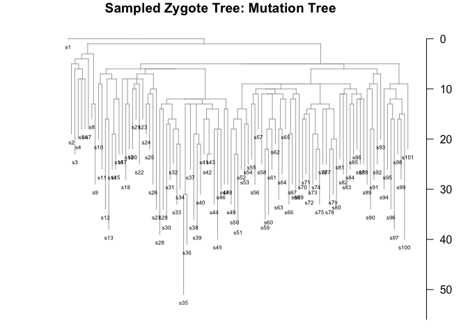

Actually this illustrates a potential problem with the outgroup sample still having a acquired mutations because it has a finite duration (0 to 365 days)..

The changes between compartments is specified in a separate data.frame, tree$events , that is maintained and updated by the simulator.

``` r
t1=plot_tree(sampledtree1m,cex.label = 0.5);title("Sampled Zygote Tree: Mutation Tree")
node_labels(t1,cex=0.5)
```

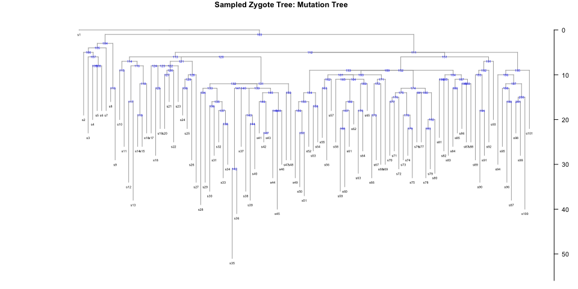

``` r
print(sampledtree1m$events)
#>   value driverid node ts
#> 1     0        0    1  0
#> 2     1        0  103  0
```

Notice how the events dataframe specifies the compartment for the outgroup and the rest of the tree.

We can introduce another cell compartment as follows:

``` r
cfg=sampledtree1$cfg
cfg=addCellCompartment(cfg,population = 5e4,rate=1/50,ndriver=1,descr="MyTissue",basefit = 0.3)
cfg$compartment$rate[2]=1/120  ## change the rate of compartment 1
sampledtree1a=addDifferentiationEvents(sampledtree1,cfg,2,nEvent=10)
print(sampledtree1a$events)
#>    value driverid node       ts
#> 1      0        0    1   0.0000
#> 2      1        0  103   0.0000
#> 3      2        0    6 131.9789
#> 4      2        0   31 131.9789
#> 5      2        0   32 131.9789
#> 6      2        0   42 131.9789
#> 7      2        0   50 131.9789
#> 8      2        0   66 131.9789
#> 9      2        0   91 131.9789
#> 10     2        0   92 131.9789
#> 11     2        0   99 131.9789
#> 12     2        0  101 131.9789
```

Each branch carries its final compartment membership in the "state" vector.

``` r
sampledtree1a$color = c("grey","black","red")[sampledtree1a$state+1]
plot_tree(sampledtree1a,cex.label = 0.5);title("Highlights branches with compartment changes")
#> 
#> Phylogenetic tree with 101 tips and 100 internal nodes.
#> 
#> Tip labels:
#>  s1, s2, s3, s4, s5, s6, ...
#> 
#> Rooted; includes branch lengths.
```

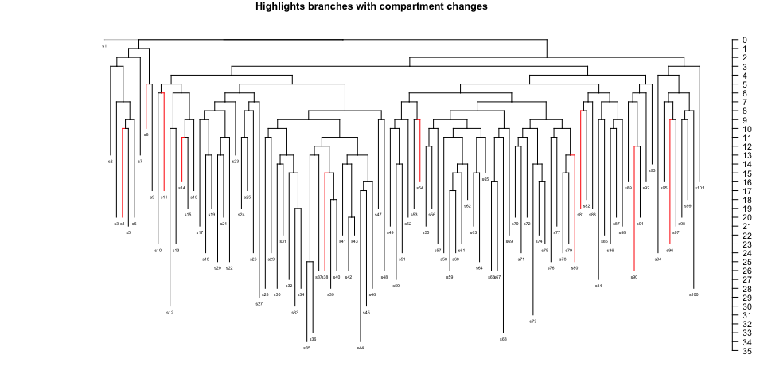 The above plot does not capture the situation when compartment changes take place mid-branch - so alternatively we can better visualise the situation using the built in function *plot\_tree\_events*

``` r
plot_tree_events(sampledtree1a)
```

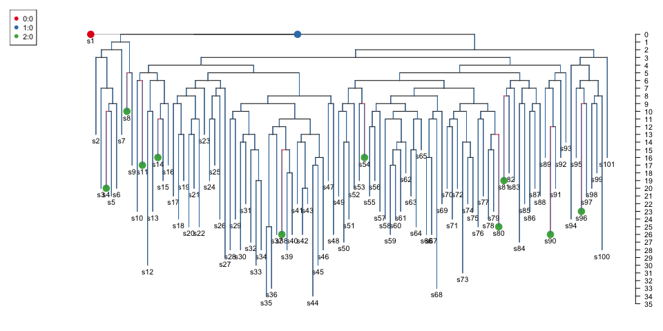

    #>   uval     col pch
    #> 1  0:0 #E41A1C  19
    #> 2  1:0 #377EB8  19
    #> 3  2:0 #4DAF4A  19
    #> 
    #> Phylogenetic tree with 101 tips and 100 internal nodes.
    #> 
    #> Tip labels:
    #>  s1, s2, s3, s4, s5, s6, ...
    #> 
    #> Rooted; includes branch lengths.

We've already updated the config with the target population sizes and division rates, so we're ready to simulate:

``` r
sp2=sim_pop(sampledtree1a,params=list(n_sim_days=365*10),cfg=sampledtree1a$cfg)
#> n_sim_days: 3650
#> b_stop_if_empty: 0
#> b_stop_at_pop_size: 0
#> maxt: 131.978889898977
#> driver_rate_per_cell_per_day: 0
#> MAX_EVENTS= 7300 
#> MAX_SIZE= 300003
sp2=combine_simpops(sp,sp2)
plot(sp2)
```

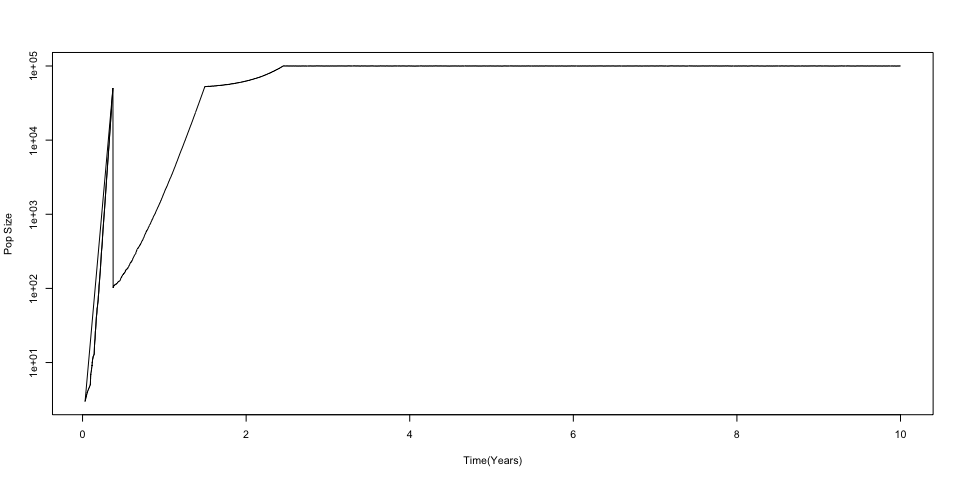

``` r
sampledtree2=get_subsampled_tree(sp2,100)
#> Starting checking the validity of tmp...
#> Found number of tips: n = 101 
#> Found number of nodes: m = 100 
#> Done.
plot_tree_events(sampledtree2,cex.label = 0.5)
```

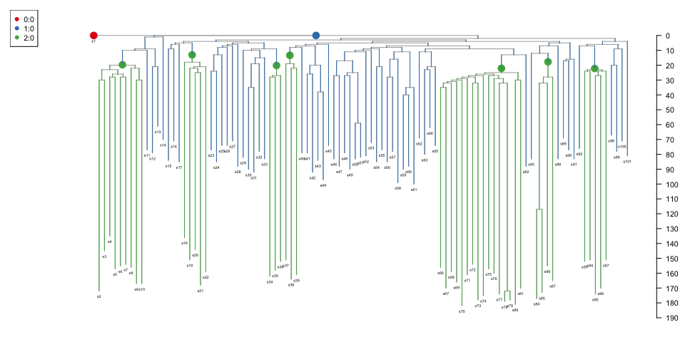

    #>   uval     col pch
    #> 1  0:0 #E41A1C  19
    #> 2  1:0 #377EB8  19
    #> 3  2:0 #4DAF4A  19
    #> 
    #> Phylogenetic tree with 101 tips and 100 internal nodes.
    #> 
    #> Tip labels:
    #>  s1, s2, s3, s4, s5, s6, ...
    #> 
    #> Rooted; includes branch lengths.

Selection based simulation
--------------------------

Here we are interested in the simple situation of one cellular compartment with multiple sub-compartments.

``` r
run_selection_sim
#> function (initial_division_rate = 0.1, final_division_rate = 1/365, 
#>     target_pop_size = 1e+05, nyears_driver_acquisition = 15, 
#>     nyears = 40, fitness = 0.2, minprop = 0.001, mindriver = 1, 
#>     maxtry = 40) 
#> {
#>     cfg = getDefaultConfig(target_pop_size, rate = initial_division_rate, 
#>         ndriver = 1, basefit = fitness)
#>     params = list(n_sim_days = nyears_driver_acquisition * 365, 
#>         b_stop_at_pop_size = 1, b_stop_if_empty = 0)
#>     growthphase = sim_pop(NULL, params = params, cfg)
#>     ndivkeep = 0
#>     mdivkeep = 0
#>     gdivkeep = 0
#>     tree0 = get_tree_from_simpop(growthphase)
#>     if (growthphase$status == 0) {
#>         tree1 = tree0
#>         params[["n_sim_days"]] = nyears * 365
#>         params[["b_stop_if_empty"]] = 1
#>         dc = 0
#>         tries = 0
#>         tree1_tmp = tree1
#>         while (dc < max(minprop * target_pop_size, mindriver)) {
#>             if (tries >= maxtry) {
#>                 return(NULL)
#>             }
#>             cat("No driver found: tries=", tries, "\n")
#>             tries = tries + 1
#>             tree1_tmp = addDriverEvent(tree1, tree1$cfg, 1, fitness = fitness)
#>             print(tree1_tmp$cfg$info)
#>             params[["b_stop_at_pop_size"]] = 1
#>             adult2 = sim_pop(tree1_tmp, params = params, tree1_tmp$cfg)
#>             adult2a = combine_simpops(growthphase, adult2)
#>             tree2 = get_tree_from_simpop(adult2a)
#>             params[["b_stop_at_pop_size"]] = 0
#>             cfg = tree2$cfg
#>             cfg$compartment$rate[2] = final_division_rate
#>             cfg$compartment$popsize[2] = target_pop_size
#>             adult2 = sim_pop(tree2, params = params, cfg)
#>             adult2 = combine_simpops(adult2a, adult2)
#>             dc = adult2$cfg$info$population[3]
#>         }
#>     }
#>     else {
#>         gdivkeep = mean(nodeHeights(tree0)[which(tree0$edge[, 
#>             2] <= length(tree0$tip.label)), 2])
#>         cfg$compartment$rate[2] = final_division_rate
#>         cfg$compartment$popsize[2] = target_pop_size
#>         years = nyears
#>         params[["n_sim_days"]] = nyears_driver_acquisition * 
#>             365
#>         params[["b_stop_at_pop_size"]] = 0
#>         adult1 = sim_pop(tree0, params = params, cfg)
#>         adult1 = combine_simpops(growthphase, adult1)
#>         tree1 = get_tree_from_simpop(adult1)
#>         params[["n_sim_days"]] = nyears * 365
#>         params[["b_stop_if_empty"]] = 1
#>         dc = 0
#>         tries = 0
#>         tree1_tmp = tree1
#>         while (dc < max(minprop * target_pop_size, mindriver)) {
#>             if (tries >= maxtry) {
#>                 return(NULL)
#>             }
#>             cat("No driver found: tries=", tries, "\n")
#>             tries = tries + 1
#>             tree1_tmp = addDriverEvent(tree1, tree1$cfg, 1, fitness = fitness)
#>             if (TRUE) {
#>                 ndivkeep = nodeHeights(tree1_tmp)[which(tree1_tmp$edge[, 
#>                   2] == tree1_tmp$events$node[3]), 2]
#>                 mdivkeep = mean(nodeHeights(tree1_tmp)[which(tree1_tmp$edge[, 
#>                   2] <= length(tree1_tmp$tip.label)), 2])
#>             }
#>             print(tree1_tmp$cfg$info)
#>             adult2 = sim_pop(tree1_tmp, params = params, tree1_tmp$cfg)
#>             dc = adult2$cfg$info$population[3]
#>         }
#>         adult2 = combine_simpops(adult1, adult2)
#>     }
#>     fulltree = get_tree_from_simpop(adult2)
#>     fulltree$tries = tries
#>     fulltree$ndivkeep = ndivkeep
#>     fulltree$mdivkeep = mdivkeep
#>     fulltree$gdivkeep = gdivkeep
#>     return(fulltree)
#> }
#> <bytecode: 0x7f8120750e90>
#> <environment: namespace:rsimpop>
selsim=run_selection_sim(0.05,1/(2*190),target_pop_size = 5e4,nyears = 50,fitness=0.3)
#> n_sim_days: 5475
#> b_stop_if_empty: 0
#> b_stop_at_pop_size: 1
#> maxt: 0
#> driver_rate_per_cell_per_day: 0
#> MAX_EVENTS= 10950 
#> MAX_SIZE= 150003 
#> n_sim_days: 5475
#> b_stop_if_empty: 0
#> b_stop_at_pop_size: 0
#> maxt: 190.207525009629
#> driver_rate_per_cell_per_day: 0
#> MAX_EVENTS= 10950 
#> MAX_SIZE= 150003 
#> No driver found: tries= 0 
#>    val population fitness id driver1
#> 1    0          1     0.0  0       0
#> 2    1      49967     0.0  0       0
#> 21   1          1     0.3  1       1
#> n_sim_days: 18250
#> b_stop_if_empty: 1
#> b_stop_at_pop_size: 0
#> maxt: 5475.00012926654
#> driver_rate_per_cell_per_day: 0
#> MAX_EVENTS= 36500 
#> MAX_SIZE= 150003 
#> No driver found: tries= 1 
#>    val population fitness id driver1
#> 1    0          1     0.0  0       0
#> 2    1      49967     0.0  0       0
#> 21   1          1     0.3  1       1
#> n_sim_days: 18250
#> b_stop_if_empty: 1
#> b_stop_at_pop_size: 0
#> maxt: 5475.00012926654
#> driver_rate_per_cell_per_day: 0
#> MAX_EVENTS= 36500 
#> MAX_SIZE= 150003 
#> No driver found: tries= 2 
#>    val population fitness id driver1
#> 1    0          1     0.0  0       0
#> 2    1      49967     0.0  0       0
#> 21   1          1     0.3  1       1
#> n_sim_days: 18250
#> b_stop_if_empty: 1
#> b_stop_at_pop_size: 0
#> maxt: 5475.00012926654
#> driver_rate_per_cell_per_day: 0
#> MAX_EVENTS= 36500 
#> MAX_SIZE= 150003
print(selsim$cfg$info)
#>    val population fitness id driver1
#> 1    0          1     0.0  0       0
#> 2    1       7450     0.0  0       0
#> 21   1      42556     0.3  1       1
```

Plot a sampled tree

``` r
seltree100=get_subsampled_tree(selsim,100)
#> Starting checking the validity of tmp...
#> Found number of tips: n = 101 
#> Found number of nodes: m = 100 
#> Done.
print(seltree100$cfg$info)
#>    val population fitness id driver1
#> 1    0          1     0.0  0       0
#> 2    1         10     0.0  0       0
#> 21   1         90     0.3  1       1
plot_tree_events(seltree100,cex.label = 0);title("Selection Based Tree: Branch Length=#Self Renewal Divisions")
#>   uval     col pch
#> 1  0:0 #E41A1C  19
#> 2  1:0 #377EB8  19
#> 3  1:1 #4DAF4A  19
#> 
#> Phylogenetic tree with 101 tips and 100 internal nodes.
#> 
#> Tip labels:
#>  s1, s2, s3, s4, s5, s6, ...
#> 
#> Rooted; includes branch lengths.
```


``` r
seltree100rt=get_elapsed_time_tree(seltree100)
tree=plot_tree_events(seltree100rt,cex.label = 0);title("Selection Based Tree: Branch Length=#Real Time")
#>   uval     col pch
#> 1  0:0 #E41A1C  19
#> 2  1:0 #377EB8  19
#> 3  1:1 #4DAF4A  19
```

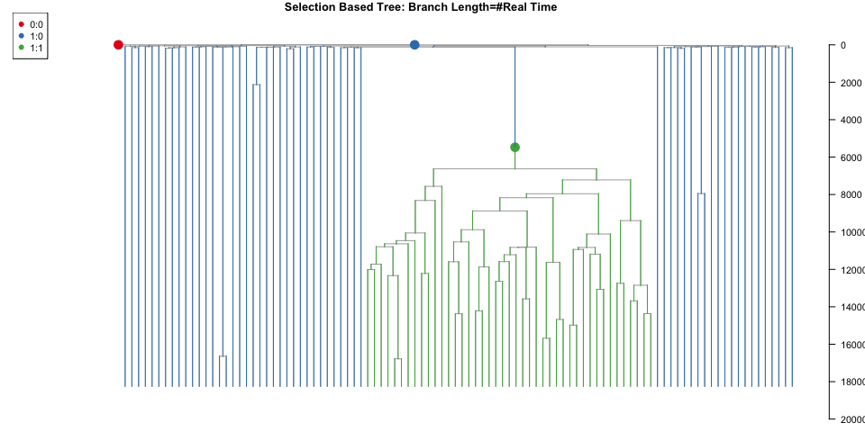

``` r
mp=5
seltree100m=get_elapsed_time_tree(seltree100,mutrateperdivision=mp,backgroundrate=(20-(365/190)*mp)/365)
plot_tree_events(seltree100m,cex.label = 0.5);title("Selection Based Tree: Branch Length=#Mutations")
#>   uval     col pch
#> 1  0:0 #E41A1C  19
#> 2  1:0 #377EB8  19
#> 3  1:1 #4DAF4A  19
#> 
#> Phylogenetic tree with 101 tips and 100 internal nodes.
#> 
#> Tip labels:
#>  s1, s2, s3, s4, s5, s6, ...
#> 
#> Rooted; includes branch lengths.
```

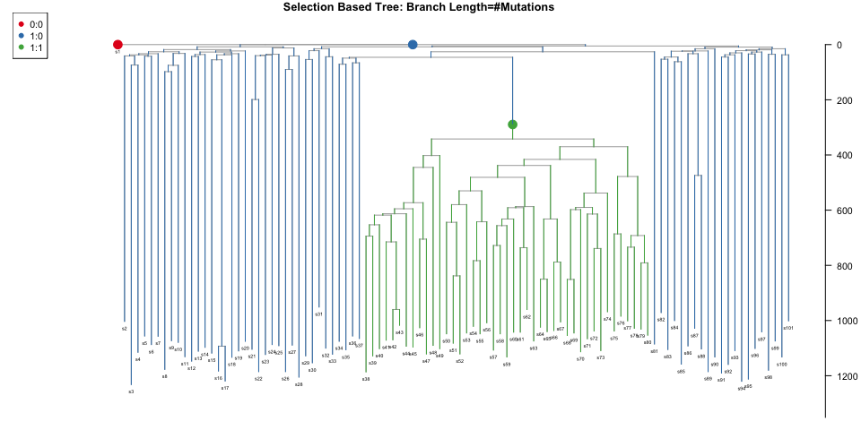

``` r
seltree100m2=get_elapsed_time_tree(seltree100,mutrateperdivision=20*(190/365),backgroundrate=0)
plot_tree_events(seltree100m2,cex.label = 0.5);title("Selection Based Tree: Branch Length=#Mutations v2")
#>   uval     col pch
#> 1  0:0 #E41A1C  19
#> 2  1:0 #377EB8  19
#> 3  1:1 #4DAF4A  19
#> 
#> Phylogenetic tree with 101 tips and 100 internal nodes.
#> 
#> Tip labels:
#>  s1, s2, s3, s4, s5, s6, ...
#> 
#> Rooted; includes branch lengths.
```

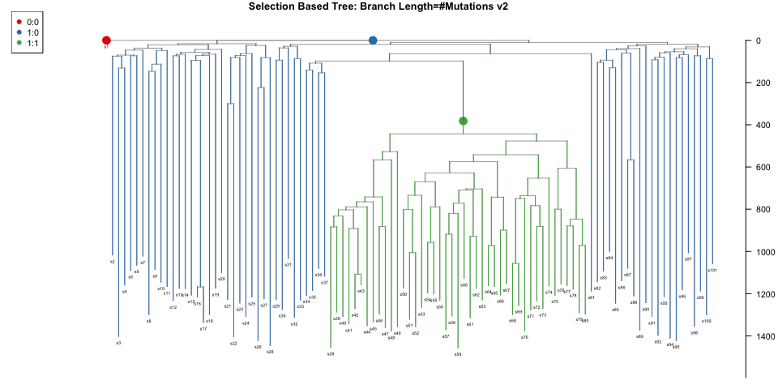

Transient selection
-------------------

``` r
run_transient_selection
#> function (initial_division_rate, final_division_rate, target_pop_size = 1e+05, 
#>     nyears_driver_acquisition = 15, nyears_transient_end = 30, 
#>     nyears = 40, fitness = 0.2, minprop = 0.05) 
#> {
#>     selsim = run_selection_sim(initial_division_rate, final_division_rate, 
#>         target_pop_size, nyears_driver_acquisition, nyears_transient_end, 
#>         fitness, minprop)
#>     cfg = selsim$cfg
#>     cfg$info$fitness[3] = 0
#>     params = selsim$params
#>     params[["n_sim_days"]] = nyears * 365
#>     params[["maxt"]] = NULL
#>     final = sim_pop(selsim, params = params, cfg)
#>     final = combine_simpops(selsim, final)
#>     return(get_tree_from_simpop(final))
#> }
#> <bytecode: 0x7f8123ab1390>
#> <environment: namespace:rsimpop>
tselsim=run_transient_selection(0.05,1/(2*190),target_pop_size = 5e4,nyears_driver_acquisition=15,
                                  nyears_transient_end=30,
                                  nyears=50,
                                  fitness=0.5)
#> n_sim_days: 5475
#> b_stop_if_empty: 0
#> b_stop_at_pop_size: 1
#> maxt: 0
#> driver_rate_per_cell_per_day: 0
#> MAX_EVENTS= 10950 
#> MAX_SIZE= 150003 
#> n_sim_days: 5475
#> b_stop_if_empty: 0
#> b_stop_at_pop_size: 0
#> maxt: 199.440023835878
#> driver_rate_per_cell_per_day: 0
#> MAX_EVENTS= 10950 
#> MAX_SIZE= 150003 
#> No driver found: tries= 0 
#>    val population fitness id driver1
#> 1    0          1     0.0  0       0
#> 2    1      49958     0.0  0       0
#> 21   1          1     0.5  1       1
#> n_sim_days: 10950
#> b_stop_if_empty: 1
#> b_stop_at_pop_size: 0
#> maxt: 5475.00220311043
#> driver_rate_per_cell_per_day: 0
#> MAX_EVENTS= 21900 
#> MAX_SIZE= 150003 
#> No driver found: tries= 1 
#>    val population fitness id driver1
#> 1    0          1     0.0  0       0
#> 2    1      49958     0.0  0       0
#> 21   1          1     0.5  1       1
#> n_sim_days: 10950
#> b_stop_if_empty: 1
#> b_stop_at_pop_size: 0
#> maxt: 5475.00220311043
#> driver_rate_per_cell_per_day: 0
#> MAX_EVENTS= 21900 
#> MAX_SIZE= 150003 
#> No driver found: tries= 2 
#>    val population fitness id driver1
#> 1    0          1     0.0  0       0
#> 2    1      49958     0.0  0       0
#> 21   1          1     0.5  1       1
#> n_sim_days: 10950
#> b_stop_if_empty: 1
#> b_stop_at_pop_size: 0
#> maxt: 5475.00220311043
#> driver_rate_per_cell_per_day: 0
#> MAX_EVENTS= 21900 
#> MAX_SIZE= 150003 
#> No driver found: tries= 3 
#>    val population fitness id driver1
#> 1    0          1     0.0  0       0
#> 2    1      49958     0.0  0       0
#> 21   1          1     0.5  1       1
#> n_sim_days: 10950
#> b_stop_if_empty: 1
#> b_stop_at_pop_size: 0
#> maxt: 5475.00220311043
#> driver_rate_per_cell_per_day: 0
#> MAX_EVENTS= 21900 
#> MAX_SIZE= 150003 
#> No driver found: tries= 4 
#>    val population fitness id driver1
#> 1    0          1     0.0  0       0
#> 2    1      49958     0.0  0       0
#> 21   1          1     0.5  1       1
#> n_sim_days: 10950
#> b_stop_if_empty: 1
#> b_stop_at_pop_size: 0
#> maxt: 5475.00220311043
#> driver_rate_per_cell_per_day: 0
#> MAX_EVENTS= 21900 
#> MAX_SIZE= 150003 
#> n_sim_days: 18250
#> b_stop_if_empty: 1
#> b_stop_at_pop_size: 0
#> maxt: 10950.0002197791
#> driver_rate_per_cell_per_day: 0
#> MAX_EVENTS= 36500 
#> MAX_SIZE= 150003
tseltree200=get_subsampled_tree(seltree,200)
#> Error in get_subsampled_tree(seltree, 200): object 'seltree' not found
plot_tree_events(get_elapsed_time_tree(tseltree200),cex.label=0)
#> Error in get_elapsed_time_tree(tseltree200): object 'tseltree200' not found
```

Neutral simulation with a trajectory
------------------------------------

Create a trajectory dataframe with 3 columns (ts,target\_pop\_size,division\_rate) and simulate using the run\_neutral\_trajectory wrapper function. Note that timestamps and rates are expressed in units of days and expected divisions per day respectively.

``` r
trajectory=data.frame(ts=365*(1:80),target_pop_size=5e4+100*(1:80),division_rate=1/(2*190))
trajectory$target_pop_size[5:10]=2*trajectory$target_pop_size[5:10]
trajectory$target_pop_size[11:15]=0.2*trajectory$target_pop_size[11:15]
print(head(trajectory))
#>     ts target_pop_size division_rate
#> 1  365           50100   0.002631579
#> 2  730           50200   0.002631579
#> 3 1095           50300   0.002631579
#> 4 1460           50400   0.002631579
#> 5 1825          101000   0.002631579
#> 6 2190          101200   0.002631579
sp=run_neutral_trajectory(NULL,0.5,trajectory)
plot(sp,xlim=c(0,100))
lines(trajectory$ts/365,trajectory$target_pop_size,col="red")
legend("topright",c("Target","Actual"),col=c("red","black"),lwd=1)
```

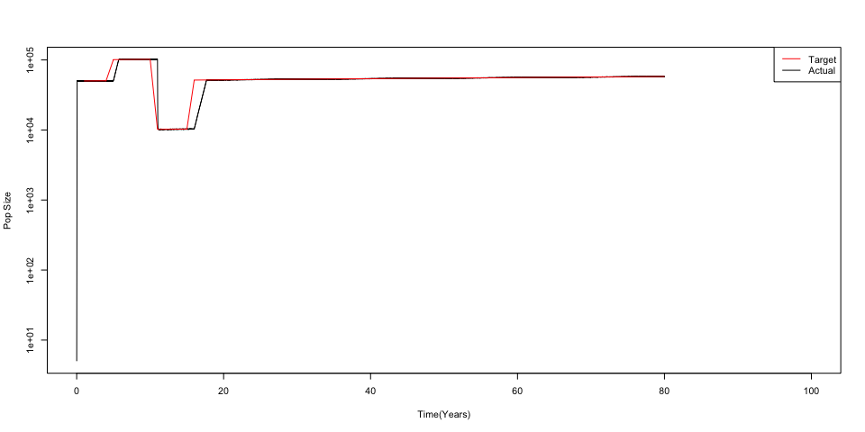

``` r
fulltree=get_tree_from_simpop(sp)
st=get_subsampled_tree(fulltree,100)
#> Starting checking the validity of tmp...
#> Found number of tips: n = 101 
#> Found number of nodes: m = 100 
#> Done.
plot_tree(get_elapsed_time_tree(st),cex.label = 0)
```


    #> 
    #> Phylogenetic tree with 101 tips and 100 internal nodes.
    #> 
    #> Tip labels:
    #>  s1, s2, s3, s4, s5, s6, ...
    #> 
    #> Rooted; includes branch lengths.

Multiple drivers
----------------

Multiple drivers can be generated at a specified rate so the waiting time between events is exponentially distributed.

Firstly the user need to create a function that draws a selection coefficient from a distibution. The simulator isn't optimised to maintain 100s of variants at once - so it is suggested that a minumum selective coefficient be specified (say 0.05) and driver incidence made correspondingly rarer.

``` r
fitnessGen=function(){
  trials=rexp(100,rate=30)
  idx=which(trials>0.05)
  if(length(idx)==0){
    fitnessGen()
  }else{
    trials[idx[1]]
  }
}
hist(sapply(1:100000,function(i) exp(fitnessGen())-1),breaks=seq(0,100,0.01),xlim=c(0,1),xlab="Selective Coefficient Per Year",main="Sampled Selective Cofficent Distribution")
```

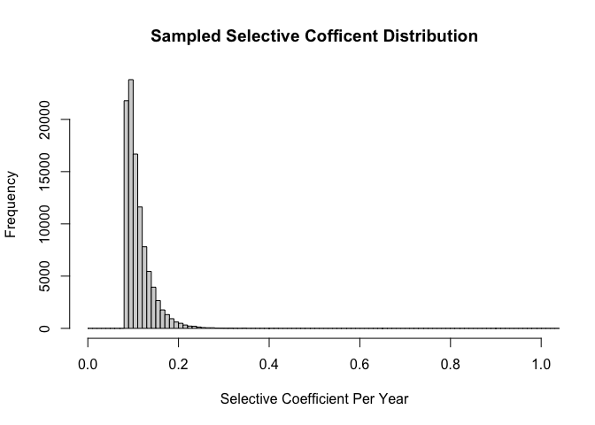

Now run the sim:

``` r
dps=run_driver_process_sim(0.1,1/(2*190),target_pop_size = 1e5,nyears = 80,fitness=fitnessGen,drivers_per_year = 1)
```

Look at the final per driver counts

``` r
print(dps$cfg$info %>% filter(population>0))
#>   val population   fitness id driver1 driver2 driver3 driver4 driver5 driver6
#> 1   0          1 0.0000000  0       0       0       0       0       0       0
#> 2   1      29381 0.0000000  0       0       0       0       0       0       0
#> 3   1      69744 0.1744176  1       1       0       0       0       0       0
#> 4   1        788 0.1151932  2       0       1       0       0       0       0
#> 5   1         32 0.1012092  7       0       0       0       0       0       0
#> 6   1          1 0.2408516  3       1       0       1       0       0       0
#> 7   1          1 0.2992108  4       1       0       0       1       0       0
#>   driver7
#> 1       0
#> 2       0
#> 3       0
#> 4       0
#> 5       1
#> 6       0
#> 7       0
```

Plot an example sampled tree

``` r
dpst=get_subsampled_tree(dps,200)
#> Starting checking the validity of tmp...
#> Found number of tips: n = 201 
#> Found number of nodes: m = 200 
#> Done.
dpst=get_elapsed_time_tree(dpst)
plot_tree_events(dpst)
```


    #>   uval     col pch
    #> 1  0:0 #E41A1C  19
    #> 2  1:0 #377EB8  19
    #> 3  1:1 #4DAF4A  19
    #> 4  1:2 #984EA3  19
    #> 
    #> Phylogenetic tree with 201 tips and 200 internal nodes.
    #> 
    #> Tip labels:
    #>  s1, s2, s3, s4, s5, s6, ...
    #> 
    #> Rooted; includes branch lengths.
    dpst=get_elapsed_time_tree(dpst,mutrateperdivision = 1,backgroundrate = 19/365)
    plot_tree_events(dpst)

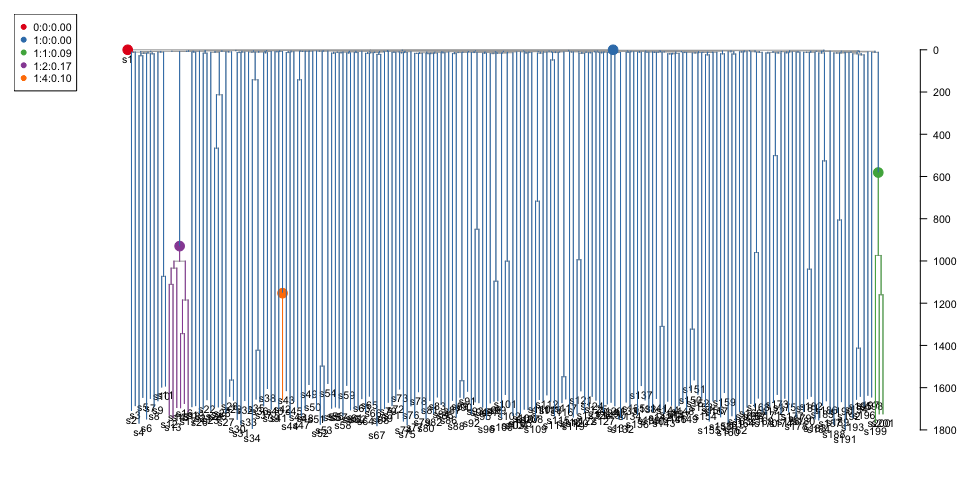

    #>   uval     col pch
    #> 1  0:0 #E41A1C  19
    #> 2  1:0 #377EB8  19
    #> 3  1:1 #4DAF4A  19
    #> 4  1:2 #984EA3  19
    #> 
    #> Phylogenetic tree with 201 tips and 200 internal nodes.
    #> 
    #> Tip labels:
    #>  s1, s2, s3, s4, s5, s6, ...
    #> 
    #> Rooted; includes branch lengths.

Continue simulating the same individual until the age of 90

``` r
dps90=continue_driver_process_sim(dps,90,fitnessGen = fitnessGen)
```

Note the driver ids are reused once they become extinct so there is no guarantee they are preserved between runs.

``` r
dpst=get_subsampled_tree(dps90,200)
#> Starting checking the validity of tmp...
#> Found number of tips: n = 201 
#> Found number of nodes: m = 200 
#> Done.
dpst=get_elapsed_time_tree(dpst)
plot_tree_events(dpst)
```

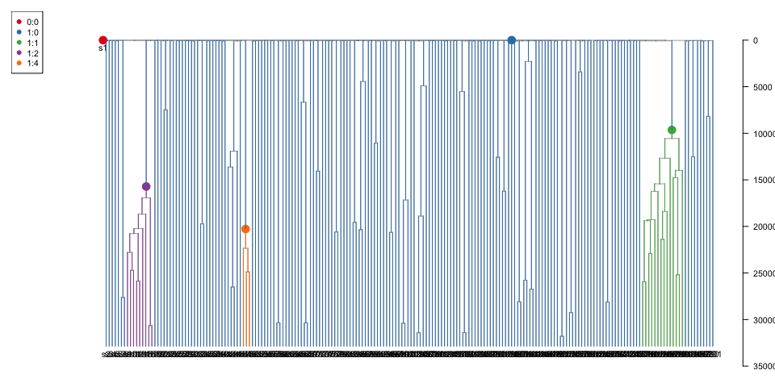

    #>   uval     col pch
    #> 1  0:0 #E41A1C  19
    #> 2  1:0 #377EB8  19
    #> 3  1:1 #4DAF4A  19
    #> 
    #> Phylogenetic tree with 201 tips and 200 internal nodes.
    #> 
    #> Tip labels:
    #>  s1, s2, s3, s4, s5, s6, ...
    #> 
    #> Rooted; includes branch lengths.
